# Challenges creating a visual language with emoji

Are there enough contemporary Unicode emoji to support visual communication of complex ideas entirely in reasonably recognizable emoji?

No — at least, not yet. Too much is missing.

The [Emojese emoji language](https://emojese.org) project takes a shot at assigning intuitive emoji representations of a reasonably large vocabulary for general communication. There are already enough emoji to make that possible, but many common words have no obvious representation emoji.

1. While there are some 1300 emoji (not counting skin tones), they are over-concentrated in a few areas, particularly facial expressions, hearts, animals, foods, occupations, and cultural touchstones.
2. There are very few verbs, adjectives, adverbs, prepositions, or pronouns. Setting aside the fact that there is no widely-understood grammar that could tie these together — there simply aren’t enough basic building blocks to express many common thoughts in emoji.
3. Reviewing lists of common English words, emoji is missing obvious representations of the many of the most common words found in English (and, presumably, most other languages).
4. The current emoji submission process does not seem driven by a process likely to fill in the missing pieces soon, or in a systematic manner.

But, given sufficient interest and organization, this state of affairs can be changed.

## Words without obvious emoji

To motivate the current situation with concrete examples, here’s a list of very common English words which Emojese struggles to express in emoji. The Frequency number gives the word’s position in a list of 500 most frequent words in the [Oxford English Corpus](https://en.wikipedia.org/wiki/Oxford_English_Corpus). (Frequency analysis by [sketchengine.eu](https://www.sketchengine.eu/english-word-list/).) While the OEC may not be representative of contemporary text messages that include emoji, if a word is in the OEC’s top 500, it’s an _extremely_ common English word.

Hypothetical icons are from [Noun Project](https://thenounproject.com/); see [credits](../static/experimental/credits.md).

| English word             | Freq # | Analysis                                                                                                                                                                                                                                                                                                                                                                                                                                                                                                                                                         | Emojese solution | Icon                                                                                    |
| ------------------------ | ------ | ---------------------------------------------------------------------------------------------------------------------------------------------------------------------------------------------------------------------------------------------------------------------------------------------------------------------------------------------------------------------------------------------------------------------------------------------------------------------------------------------------------------------------------------------------------------- | ---------------- | --------------------------------------------------------------------------------------- |
| above                    | 426    | No obvious emoji. As with all prepositions, Emojese settles for a Unicode character that can at least suggest a spatial arrangement, here ◓ Circle with Upper Half Black.                                                                                                                                                                                                                                                                                                                                                                                        | ◓                |            |
| animal                   |        | There are many specific animals, but nothing to represent animals generally. Emojese introduces square brackets as a category, then uses two obviously different animal emoji to represent a broad category of animals.                                                                                                                                                                                                                                                                                                                                          | [🐘🐟]           | 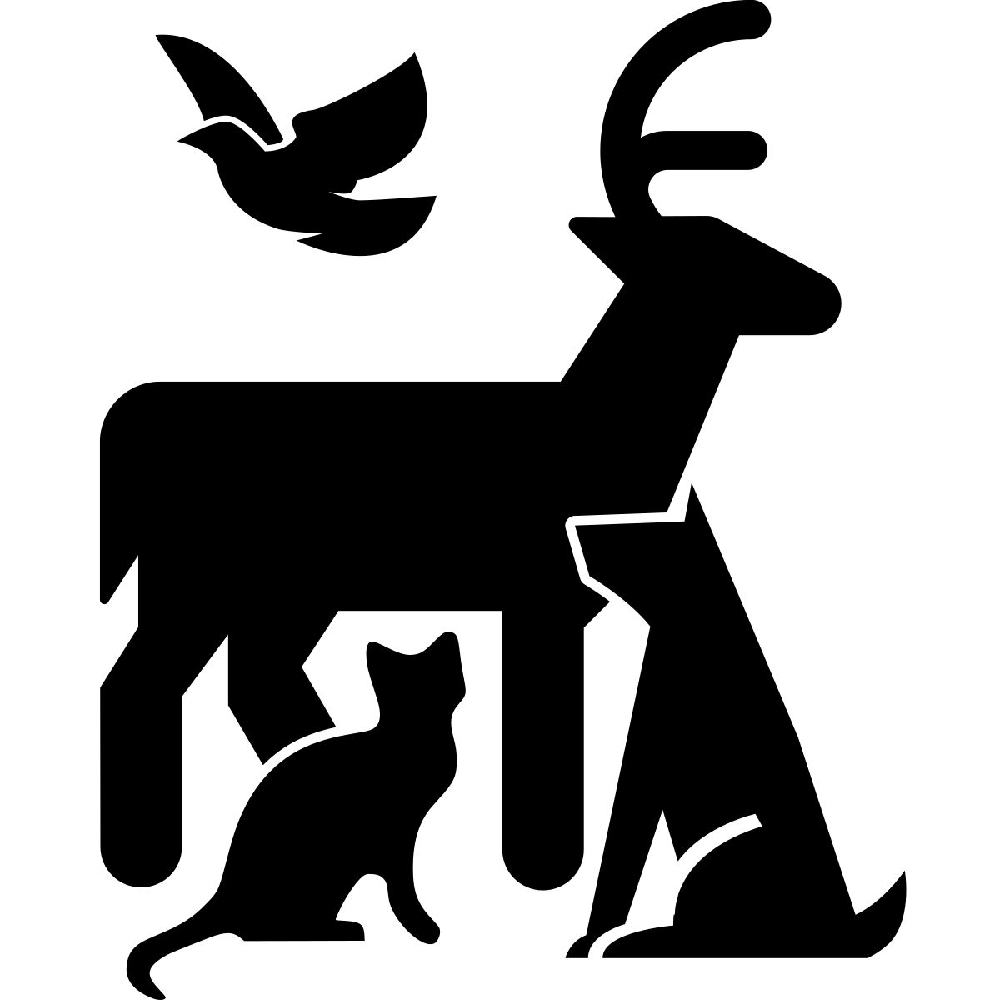          |
| apartment                |        | For a rapidly-urbanizing world, there is only one generic large building, 🏢 Office Building. An apartment building could be distinguished with balconies, perhaps. The Emojese solution adds ◱ White Square With Lower Left Quadrant to suggest a room.                                                                                                                                                                                                                                                                                                         | 🏢◱              | 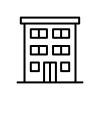       |
| back (direction)         | 110    | See “above”. Emojese solution uses ◐ Circle with Left Half Black to represent “back”.                                                                                                                                                                                                                                                                                                                                                                                                                                                                            | ◐                |           |
| back (body)              | 110    | No obvious emoji. Emojese uses 👤 Bust in Silhouette with ◐ Circle with Left Half Black (cf. "back", above).                                                                                                                                                                                                                                                                                                                                                                                                                                                     | 👤◐              | 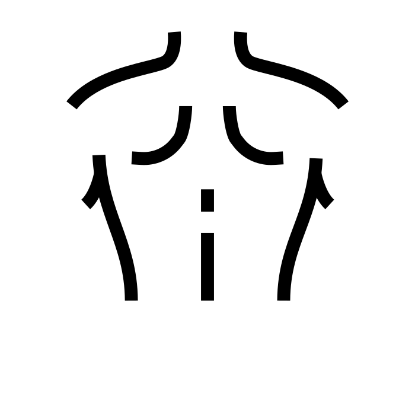           |
| become                   | 254    | There are almost no abstract action emoji, but such words are among our most common words. Emojese settles for a Mandarin-style <a href="https://eastasiastudent.net/china/mandarin/result-complement-detail-explanation/">resultative complement</a>, contrasting two states and focusing on the second, to suggest “become”.                                                                                                                                                                                                                                   | 🐛🦋             |
| bedroom                  |        | There do not appear to be any emoji to represent the common rooms of a house or apartment. To 🛌 Person in Bed, Emojese adds ◱ White Square With Lower Left Quadrant for “room”.                                                                                                                                                                                                                                                                                                                                                                                 | 🛏◱               | 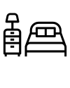        |
| big                      | 219    | This is one of many pairs in which one concept has a good emoji representation but its antonym does not. 🤏 Pinching Hand can suggest “small”, but there is nothing for “big”: two arms spread wide apart, say. Emojese represents many adjectives like “big” with a tilde for “-ish”, so: “elephant-ish”.                                                                                                                                                                                                                                                       | 🐘~              | 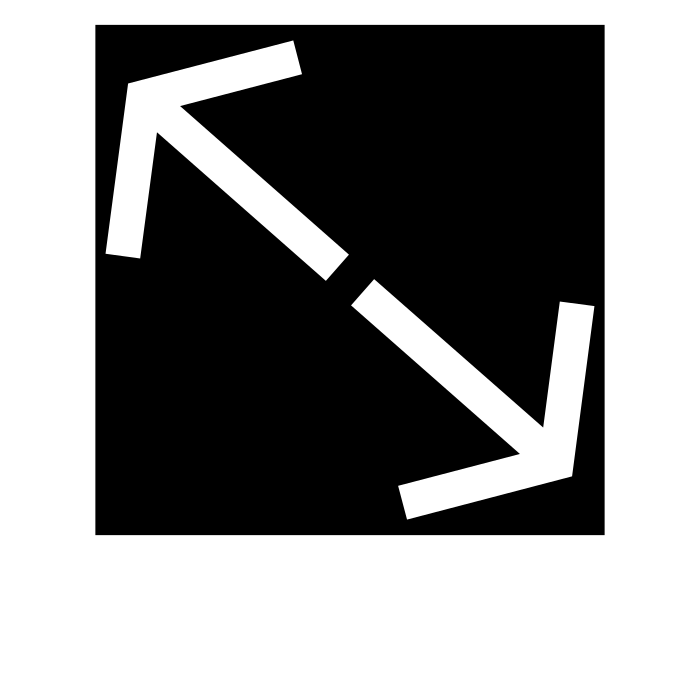         |
| body                     | 240    | There are many emoji that show a whole person’s body, but there is no emoji that focuses on the entire body, e.g., as an abstract thing. Emojese solution: ∀ For All and 👤 Bust In Silhouette for "person's body": “all of a person”.                                                                                                                                                                                                                                                                                                                           | 👤∀              | 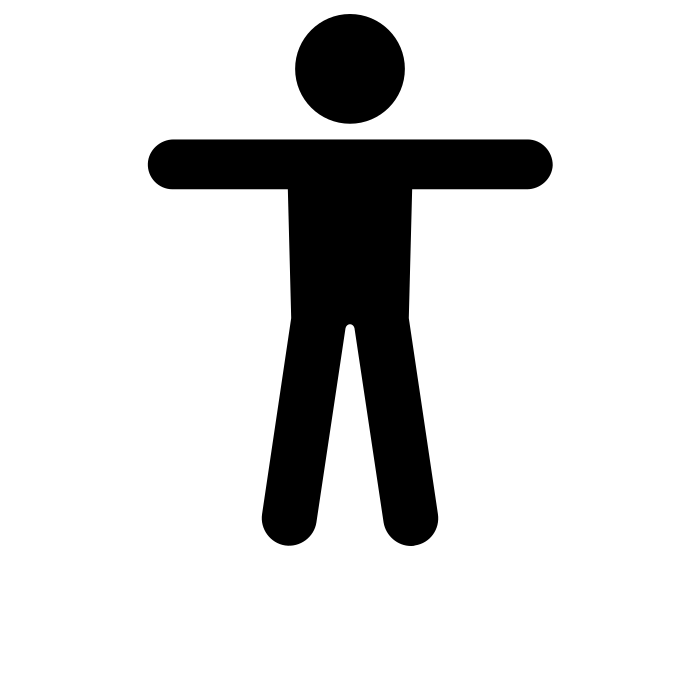           |
| bottom                   |        | No obvious emoji. Emojese uses ⌊ Left Floor and ꠵ North Indic Fraction Three Sixteenths to visually indicate the bottom of a stack.                                                                                                                                                                                                                                                                                                                                                                                                                              | ⌊꠵               | 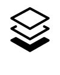          |
| brother                  |        | Mother is well-represented by 👩‍🍼 Woman Feeding Baby, and father by 👨‍🍼 Man Feeding Baby, but there is no good “brother” emoji. Emojese: 🔗 Link (for "relation") and Boy 👦.                                                                                                                                                                                                                                                                                                                                                                                      | 🔗👦             |
| buy                      | 326    | Numerous emoji like 💵 Banknote with Dollar Sign express money, but not specifically the spending of it. There is also 🛒 Shopping Cart, but that focuses on the act of shopping instead of the purchase. Emojese uses 💵 Dollar Banknote, ⇆ Leftwards Arrow Over Rightwards Arrow, and ⬚ Dotted Square to denote exchanging money to acquire a thing. See also "pay" and “sell”.                                                                                                                                                                                | 💵⇆⬚             |                                                                                         |
| can (verb)               | 29     | This extremely common abstract notion is admittedly difficult to represent visually. Emojese uses Flexed Biceps to represent potential (and as a nod to Rosie the Riveter, “We can do it”).                                                                                                                                                                                                                                                                                                                                                                      | 💪               |
| care (verb)              | 246    | There is 🧑‍⚕️ Health Worker, but nothing to directly represent one person caring for another — applying a bandage or listening with a stethoscope, say.                                                                                                                                                                                                                                                                                                                                                                                                            | 🧑‍⚕️⟿              |           |
| carry                    | 478    | People often talk about moving things around in the word, but there is no useful emoji to express holding something or carrying something. The few emoji like 🏌️Person Golfing that show something holding something focus too much on a specific activity. Emojese uses 🎒 Backpack and → Rightwards Arrow.                                                                                                                                                                                                                                                     | 🎒→              |           |
| catch                    |        | There are balls like ⚾ Baseball, but sadly no catcher’s mitt, or anything else to directly show someone catching something. Emojese uses 🕸️ Spider Web to at least suggest catching something.                                                                                                                                                                                                                                                                                                                                                                  | 🕸️               | 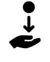        |
| choose                   |        | Another missing action verb. Emojese uses ⌥ Option Key to suggest choosing one of two options.                                                                                                                                                                                                                                                                                                                                                                                                                                                                   | ⌥                | 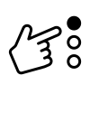         |
| close                    | 476    | There is 🌂 Closed Umbrella and 📕 Closed Book, but these are static and do not focus on the action of closing. Emojese uses a resultative complement; see “become”.                                                                                                                                                                                                                                                                                                                                                                                             | 📖📕             |
| cup                      |        | Of the 5 “glass” emoji like 🥃 Tumbler Glass, 4 seem all or partially focused on alcoholic drinks. The one exception is 🥛 Glass of Milk. It is unfortunate there is nothing that is clearly a cup that does not suggest a specific liquid.                                                                                                                                                                                                                                                                                                                      | 🥃               | 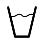              |
| deep                     |        | There is 🌊 Water Wave, but that focuses on the water surface, not the depths below. The fish emoji focus more on fish than the deep, while 🤿 Diving Mask focuses on a sport. Emojese uses ⌈ Left Ceiling for “high” + 💧 Droplet: "high water".                                                                                                                                                                                                                                                                                                                | ⌈💧              |
| difficult                |        | No obvious emoji. 🏋️ Person Lifting Weights suggests difficulty, but Emojese already capitalizes on that for “heavy”. Emojese uses 💦 Water Droplets for "sweat", plus a tilde (“-ish”) to form an adjective. (See “big”.)                                                                                                                                                                                                                                                                                                                                       | 💦~              | 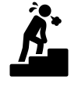          |
| dig                      |        | There is ⛏️ Pick but no shovel, nor a construction worker digging.                                                                                                                                                                                                                                                                                                                                                                                                                                                                                               | ⛏️               |             |
| dirt                     |        | There are several plants like 🌱 Seedling, but nothing for them to grow in. Emojese: 🟫 Brown Square and ⛳ Golf Hole with Flag generally for "ground": "brown ground".                                                                                                                                                                                                                                                                                                                                                                                          | 🟫⛳             |             |
| dirty                    |        | Another missing antonym; see "big". There is 🧼 Soap for “clean”, but nothing for “dirty”.                                                                                                                                                                                                                                                                                                                                                                                                                                                                       | 🚫🧼~            |           |
| dream                    |        | Dreaming seems like it could be represented by sleeping and thinking/imagining something, but no such emoji exists. Emojese combines 🛌 Person in Bed and 💭 Thought Balloon.                                                                                                                                                                                                                                                                                                                                                                                    | 🛌💭             | 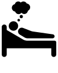       |
| drink (verb)             |        | There are a number of emoji for beverages, but nothing for the act of drinking. Emojese combines 🥛 Glass of Milk and ⇝ Rightwards Squiggle Arrow to convey action.                                                                                                                                                                                                                                                                                                                                                                                              | 🥛⟿              | 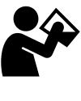        |
| dry                      |        | See “dirty” regarding emoji with no antonyms. Emojese: “not wet”.                                                                                                                                                                                                                                                                                                                                                                                                                                                                                                | 🚫💧~            | 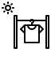            |
| dumb                     |        | 🤪 Zany Face and other faces don’t quite capture the nuance of stupidity. Emojese: 🚫 Prohibited ("no") and 🧠 Brain: "no brain".                                                                                                                                                                                                                                                                                                                                                                                                                                | 🚫🧠             |
| easy                     | 332    | No obvious emoji. Emoji like 🥧 Pie to suggest the simile “easy as pie” are likely meaningless outside English-speaking cultures. Icons for easy often include snapping fingers, but the closest emoji, 🫰 Hand with Index Finger and Thumb Crossed, is ambiguously read as a K-Pop finger heart gesture. Emojese: 🚫 Prohibited ("no") and 💦 Water Droplets: "no sweat".                                                                                                                                                                                        | 🚫💦             |            |
| eat                      |        | Emoji like 🍽️ Fork and Knife with Plate come close, but don’t suggest action. An emoji that included a mouth and something with a bite out of it would better convey the act of eating.                                                                                                                                                                                                                                                                                                                                                                          | 🍽️               |      |
| end                      | 199    | No obvious emoji. Emojese uses 🏁 Chequered Flag for its association with the end of an auto race, but this meaning may be lost on many people.                                                                                                                                                                                                                                                                                                                                                                                                                  | 🏁               |
| expect                   |        | 🤰 Pregnant Woman seems the closest, although the direct meaning of pregnancy likely distracts from the abstract notion of expecting something.                                                                                                                                                                                                                                                                                                                                                                                                                  | 🤰               |
| fall (action)            |        | No obvious representation of something actively falling. Emojese uses 🍁 Maple Leaf for its association with falling leaves. (Ironically, 🍂 Fallen Leaf doesn’t seem to convey that as well, as the leaves may be interpreted to have already fallen.) The metaphoric association can work, but an icon showing something falling (like a <a href="https://thenounproject.com/search/?q=fall&i=1887964">person falling</a>) would be clearer.                                                                                                                   | 🍁               | 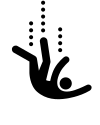        |
| fall (season)            |        | Adopting 🍁 Maple Leaf for the verb “fall” (above) means that emoji cannot also be used on its own to unambiguously reference the season. Emojese generally uses ⏰ Alarm Clock to represent the concept of time, so: “falling leaf time”.                                                                                                                                                                                                                                                                                                                       | 🍁⏰             |
| far                      | 285    | No emoji clearly expresses <a href="https://thenounproject.com/search/?q=distance">distance</a>. Emojese uses a resultative complement (see “become”) to show ⛺ Tent close up, followed by 🏕 Camping with a smaller tent. This comparison works much better in emoji sets like Apple’s than in Microsoft’s.                                                                                                                                                                                                                                                     | ⛺🏕️             | 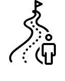            |
| farm                     |        | There is 🧑‍🌾 Farmer and 🚜 Tractor, but no farm. Emojese takes the former and adds 📍 Round Pushpin for “place”: “farmer place”.                                                                                                                                                                                                                                                                                                                                                                                                                                  | 🧑‍🌾📍             | 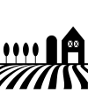            |
| feel                     | 216    | Another challenging abstract concept. There are many emoji for feelings, but none to represent the general state or concept of feeling thing. Emojese uses categorization brackets (see “animal” above) to represent the general category of feelings, plus ⇝ Rightwards Squiggle Arrow to convey action.                                                                                                                                                                                                                                                        | [😀]⟿            |                                                                                         |
| finger                   |        | Another missing body part (see “back”). Emojese uses 🧩 Puzzle Piece for "part", adding this to ✋ Raised Hand: “hand part”.                                                                                                                                                                                                                                                                                                                                                                                                                                     | ✋🧩             |          |
| fork                     |        | There’s 🍴 Fork and Knife and 🔪 Kitchen Knife, but no fork. Emojese resorts to a rebus, using ➖ Minus Sign to subtract the knife from the fork and knife.                                                                                                                                                                                                                                                                                                                                                                                                      | 🍴➖🔪           |            |
| front                    |        | Same problem as “back”. Emojese generally uses right to express direction into the future or otherwise away from the speaker, so here uses ◑ Circle with Right Half Black to focuses on the speaker's front.                                                                                                                                                                                                                                                                                                                                                     | ◑                |          |
| garden                   |        | There’s 🌱 Seedling and several other plant emoji, but none for a place with plants. Emojese adds 📍 Round Pushpin for “place”: “seedling place”.                                                                                                                                                                                                                                                                                                                                                                                                                | 🌱📍             |
| get                      | 71     | No obvious emoji for this common action. Numerous icons for "get" include something moving into a person’s hands. Emojese uses ↤ Leftwards Arrow from Bar to suggest something coming toward the speaker (represented to the left).                                                                                                                                                                                                                                                                                                                              | ↤                | 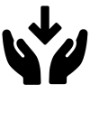            |
| give                     | 190    | Essentially the same problem as “get” above. 🎁 Wrapped Gift suggests giving, but is ambiguous as to whether the gift is being given or received. Emojese uses ↦ Rightwards Arrow from Bar, the opposite of the glyph for “get”.                                                                                                                                                                                                                                                                                                                                 | ↦                | 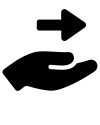           |
| grass                    |        | No obvious emoji. Emojese uses 🟩 Green Square to focus on the green grass in ⛳ Flag in Hole, which Emojese also uses generally for "ground".                                                                                                                                                                                                                                                                                                                                                                                                                   | 🟩⛳             |           |
| ground                   |        | No obvious emoji. Emojese uses ⛳ Golf Hole with Flag, one of the only emoji to show the ground, although the golf focus is distracting.                                                                                                                                                                                                                                                                                                                                                                                                                         | ⛳               |                                                                                         |
| grow                     |        | 🌱 Seedling comes closest, but there’s no action to it. Emojese uses a resultative complement (see “before”) to contrast the seeding with a full-grown 🌳 Deciduous Tree.                                                                                                                                                                                                                                                                                                                                                                                        | 🌱🌳             |          |
| hang                     |        | 🪝 Hook implies hanging. Emojese adds ⇝ Rightwards Squiggle Arrow to convey action (see “feel”).                                                                                                                                                                                                                                                                                                                                                                                                                                                                 | 🪝⟿              |
| hard (substance)         | 302    | In English, 🪵 Wood is often used to express something being hard, but on its own is ambiguous. Emojese adds ✋Raised Hand to suggest physical sensations, here one of touching hard wood. See also “difficult”.                                                                                                                                                                                                                                                                                                                                                 | 🪵🖐             |
| have                     | 20     | After the various forms of “to be” (represented in Emojese with a “=” equals sign), “have” appears to be the most common verb in English. But there is no emoji showing someone holding something or otherwise suggesting possession; see “bring”. Emojese uses 💁 Person Tipping Hand in its possible interpretation as someone holding an object.                                                                                                                                                                                                              | 💁               | 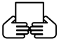            |
| hear                     |        | Icons for hear often pair an ear with audio waves, but there is no such emoji.                                                                                                                                                                                                                                                                                                                                                                                                                                                                                   | 👂               |            |
| heavy                    |        | 🏋️ Person Lifting Weights seems appropriate, although the specific activity of weightlifting may be distracting. A heavy object like an anvil or someone lifting a box which is obviously heavy might be clearer. Emojese adds 🪨 Rock.                                                                                                                                                                                                                                                                                                                          | 🏋️🪨             | 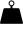           |
| help                     | 123    | Icons for help often include life rings, but these strongly imply rescue from danger; helping hands would be clearer. Emojese uses ↦ Rightwards Arrow to Bar and 🛟 Ring Buoy.                                                                                                                                                                                                                                                                                                                                                                                    | ↦🛟               | 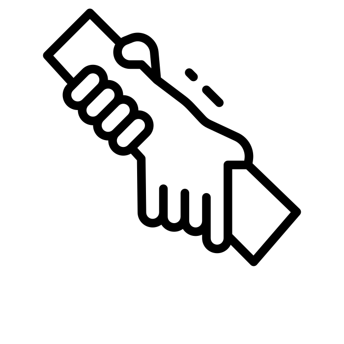           |
| high                     | 167    | ⛰️ Mountain is an obvious choice, but creates a problem because there is no corresponding antonym emoji for “low”. Emojese uses ⌈ Left Ceiling.                                                                                                                                                                                                                                                                                                                                                                                                                  | ⌈                |
| hold                     |        | As noted for “have”, there are no obvious emoji to convey holding an object. Emojese uses 🤲 Palms Up Together to at least show hands in a position that might be holding something.                                                                                                                                                                                                                                                                                                                                                                             | 🤲               |
| hope                     | 483    | 🙏 Folded Hands could suggest praying for something, but Emojese reserves that for the more frequent word “thanks”. One interpretation of 🕊️ Dove is “hope”. To that Emojese adds 🛐 Place of Worship to represent prayer (not a place specifically).                                                                                                                                                                                                                                                                                                            | 🛐🕊              |
| I/me                     | 10/73  | “I” is the most common noun in the Oxford English Corpus; “me” is also extremely frequent. Icons for “me” often include a person pointing themselves, which seems intuitive. A [Proposal for Emoji: Person Pointing at Self](https://docs.google.com/document/d/1fpOmpSgOVub9gsHY8jIbheIhZYKnn82yohdh5eQ6Zs4/edit) was, sadly, not accepted. Emojese settles for 👇 Backhand Index Pointing Down.                                                                                                                                                                | 👇               | 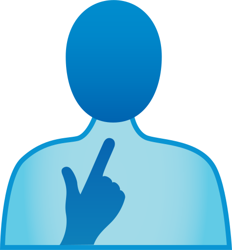      |
| in                       | 6      | No obvious emoji. Icons for "in" or "inside" generally show an arrow going into a box. The closest existing Unicode character appears to be ⇲ South East Arrow To Corner.                                                                                                                                                                                                                                                                                                                                                                                        | ⇲                | 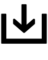         |
| jump                     |        | No obvious emoji. 🐇 Rabbit and 🦘 Kangaroo both jump, but out of context, it may not be clear what meaning is intended. Emojese adds ⇝ Rightwards Squiggle Arrow to convey action.                                                                                                                                                                                                                                                                                                                                                                              | 🐇⟿              |         |
| kick                     |        | There’s 🦵Leg and ⚽ Soccer Ball, but neither on their own is sufficient to convey kicking. Emojese adds ⇝ Rightwards Squiggle Arrow to convey action.                                                                                                                                                                                                                                                                                                                                                                                                           | 🦵⚽️⟿           | 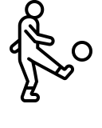           |
| kitchen                  |        | As with “bedroom”, there’s no emoji for specific rooms. There’s 🍳 Cooking, but that doesn’t focus on the cooking space. Emojese adds ◱ White Square With Lower Left Quadrant for “room”.                                                                                                                                                                                                                                                                                                                                                                        | 🍳◱              | 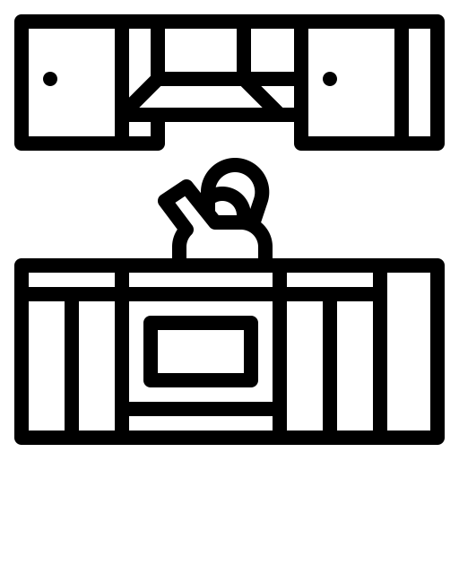        |
| knee                     |        | Another missing body part (see “back”). Emojese uses ⏀ Dentistry Symbol Light Vertical With Circle to suggest “middle” or “center” and 🔗 Link for "joint". Applied to 🦵Leg gives “leg center joint”.                                                                                                                                                                                                                                                                                                                                                           | 🦵⏀🔗            |              |
| know                     | 103    | No obvious emoji. Emojese uses 🎓 Graduation Cap as a symbol for knowledge, and by extension, the state of knowing something. It adds ♾️ Infinity to imply that the state is permanent.                                                                                                                                                                                                                                                                                                                                                                          | 🎓♾️             | 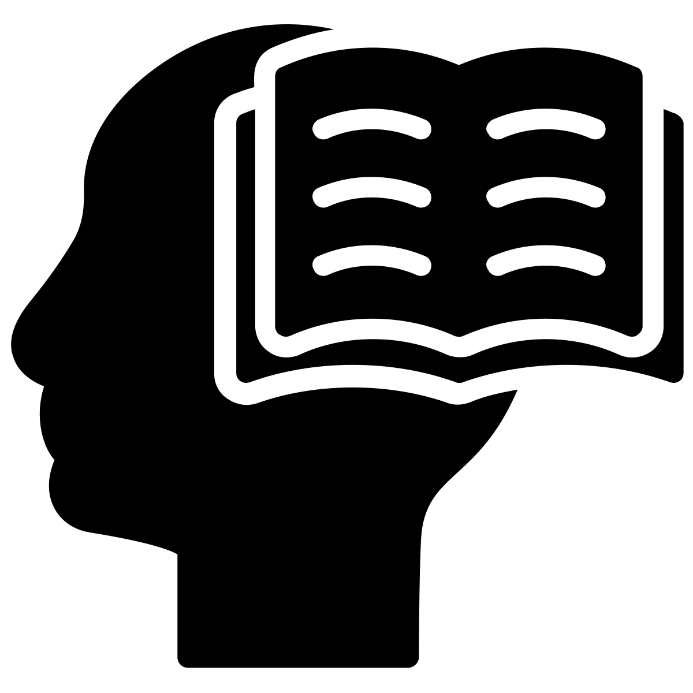      |
| lake, pond               |        | There is 🌊 Water Wave, but that looks more appropriate for an ocean than a lake. Emojese adds "⛶" Square Four Corners (for "area") to get 🌊⛶ for "ocean". Adding 🤏 Pinching Hand for “small” gives "small ocean".                                                                                                                                                                                                                                                                                                                                             | 🤏🌊⛶            |
| lamp                     |        | Like the fork in 🍴 Fork and Knife, a lamp is another object that only appears in a combination: 🛋️ Couch and Lamp. Another lamp emoji is 🪔 Diya Lamp, but that’s not suggestive of an electric lamp. Emojese uses ⚙️ Gear for “machine”, so “light machine”.                                                                                                                                                                                                                                                                                                   | 💡⚙️             | 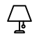            |
| lead                     |        | 🦮 Guide Dog seems fairly useful for this verb, although on its own it puts the focus on the dog and not the act of leading.                                                                                                                                                                                                                                                                                                                                                                                                                                     | 🦮               | 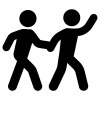           |
| learn                    | 398    | No obvious emoji. Emojese expresses this as “know-get”; see both “know” and “get” for details.                                                                                                                                                                                                                                                                                                                                                                                                                                                                   | 🎓↤              |            |
| listen                   |        | Emojese uses the same 👂 Ear as for “hear”, and so doesn’t differentiate between passive hearing and the act of listening.                                                                                                                                                                                                                                                                                                                                                                                                                                       | 👂               | 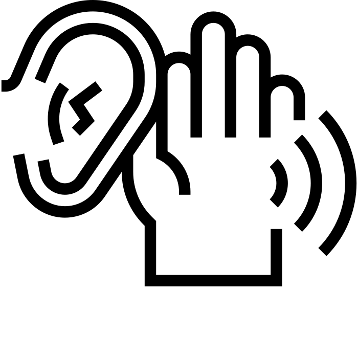         |
| long                     | 153    | As with “big”, Emojese uses an animal that characterizes a noteworthy quality — here, length — and add a tilde (“-ish”) to form an adjective.                                                                                                                                                                                                                                                                                                                                                                                                                    | 🐍~              |
| low                      | 488    | As discussed at “high”, there is no good emoji to indicate a low-lying place or object. Emojese uses ⌊ Left Floor, a visual opposite of ⌈ Left Ceiling for “high”.                                                                                                                                                                                                                                                                                                                                                                                               | ⌊                |
| magazine                 |        | No obvious emoji. Emojese uses the combination ⇥⇤ for “narrow” or “thin”, so “thin book”.                                                                                                                                                                                                                                                                                                                                                                                                                                                                        | ⇥⇤📕             |          |
| material, substance      |        | Hard to express visually. Emojese uses 🧪 Test Tube to suggest a substance or material.                                                                                                                                                                                                                                                                                                                                                                                                                                                                          | 🧪               |
| month                    | 494    | As with “week” and “year”, there is no emoji for this division of time. There are a number of moon emoji, but none show more than one phase. Emojese picks 🌙 Crescent Moon to represent a month, although a reader could easily be misled to thinking it means “night”.                                                                                                                                                                                                                                                                                         | 🌙               |
| narrow, thin             |        | No obvious emoji. Emojese uses the combination of ⇥ Rightwards Arrow To Bar and ⇤ Leftwards Arrow To Bar to visually represent two lines close together.                                                                                                                                                                                                                                                                                                                                                                                                         | ⇥⇤               |
| near                     |        | See “far”, which uses the same emoji in the opposite order.                                                                                                                                                                                                                                                                                                                                                                                                                                                                                                      | 🏕️⛺             |
| north, south, east, west |        | No obvious emoji. The 🧭 Compass points northwest, so Emojese adds an arrow glyph to point in the appropriate map direction, e.g., up for "north".                                                                                                                                                                                                                                                                                                                                                                                                               | ⥣🧭              |
| of                       | 4      | The most common word in this list, but unfortunately with no obvious visual representation. Emojese adopts 🏷️ Label Tag to suggest belonging and possession.                                                                                                                                                                                                                                                                                                                                                                                                     | 🏷️               |                                                                                         |
| office                   | 410    | There’s 🏢 Office Building, but that focuses on the building instead of a workplace, and the particular nature of the office building may not be clear. Emojese uses 🛠️ Hammer and Wrench for “work”, adding 📍 Round Pushpin for “place” (see “back”), to give “work place”.                                                                                                                                                                                                                                                                                    | 🛠️📍             | 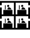           |
| open                     | 292    | See “close”, which uses the same emoji in the opposite order.                                                                                                                                                                                                                                                                                                                                                                                                                                                                                                    | 📕📖             |
| over                     |        | No obvious emoji. As with all prepositions, Emojese settles for a Unicode character that can at least suggest a spatial arrangement, here ◓ Circle with Upper Half Black.                                                                                                                                                                                                                                                                                                                                                                                        | ◓                | 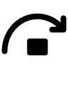         |
| pain                     |        | Emoji like 🤕 Face with Head Bandage suggest injury, but not necessarily physical or emotional discomfort. Emojese adds 💥 Collision to suggest the shock of pain.                                                                                                                                                                                                                                                                                                                                                                                               | 🤕💥             |
| part                     | 154    | A very common word. There’s 🧩 Jigsaw Puzzle Piece, but that adds an unfortunate nuance of a puzzle or difficulty.                                                                                                                                                                                                                                                                                                                                                                                                                                               | 🧩               |          |
| path                     |        | For a world dominated by roads, sidewalks, and other types of physical or metaphorical paths, there are almost no emoji to suggest “path”. 🛣️ Motorway comes closest, but all forms of that emoji are overwhelmed by a giant road sign. Emojese uses 👣 Footprints between two \| Vertical Bar characters. See also "river" and "road".                                                                                                                                                                                                                          | \|👣\|           | 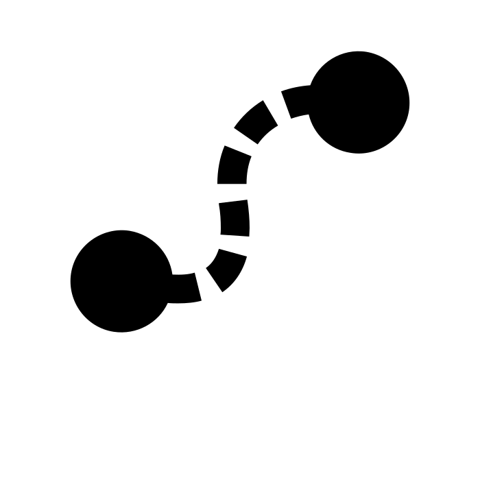           |
| pay                      |        | There are 💵 Dollar Banknotes and 💳 Credit Card, but these are static, and don't convey the action of handing over money. Emojese uses ↦ Rightwards Arrow from Bar to express "give": "give money"                                                                                                                                                                                                                                                                                                                                                              | ↦💵              |             |
| plate                    |        | Like the fork in 🍽️ Fork and Knife with Plate, the plate itself gets no love. As with "fork", Emojese resorts to a rebus to subtract 🍴 from the fork and knife with plate.                                                                                                                                                                                                                                                                                                                                                                                      | 🍽➖🍴            | 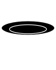          |
| pool                     |        | No obvious emoji, which is odd given the presence of many other leisure emoji like 🏖️ Beach with Umbrella. Emojese: “fountain square”.                                                                                                                                                                                                                                                                                                                                                                                                                           | ⛲🔲             |            |
| pretty                   |        | Emojese uses 🪞 Mirror generally for "appearance", adding 🤩 Face with Starry Eyes to suggest an impressive appearance.                                                                                                                                                                                                                                                                                                                                                                                                                                          | 🪞🤩             |                                                                                         |
| pull                     |        | No obvious emoji. Emojese uses ⛓️ Chains to suggest something being lifted or hauled, but those also have an unfortunate nuance of being shackled or constrained. To this Emojese adds ⟿ Rightwards Squiggle Arrow                                                                                                                                                                                                                                                                                                                                               | ⛓️⟿              | 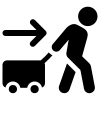           |
| push                     |        | No obvious emoji. Emojese uses 👐 Open Hands, as they are positioned in a way that might be pushing something.                                                                                                                                                                                                                                                                                                                                                                                                                                                   | 👐               |         |
| put                      | 203    | No obvious emoji. Emojese combines 📦 Package and ⬇️ Down Arrow to suggest a box being put down.                                                                                                                                                                                                                                                                                                                                                                                                                                                                 | 📦⬇️             |  |
| reach                    |        | Emojese uses 🛬 Airplane Arrival.                                                                                                                                                                                                                                                                                                                                                                                                                                                                                                                                | 🛬               |
| read                     | 217    | There are multiple book emoji, but none being read. 📖 Open Book comes the closest; Emojese adds ⇝ Rightwards Squiggle Arrow to convey action.                                                                                                                                                                                                                                                                                                                                                                                                                   | 📖⟿              | 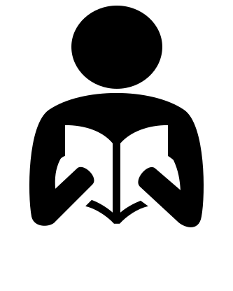           |
| ready                    |        | As with “big”, Emojese uses an animal that characterizes a noteworthy quality. Here, 🐿️ Chipmunk is used as a stand-in for a squirrel, known in some temperate climates as an animal that prepares for winter by gathering nuts. Emojese add a tilde (“-ish”) to form an adjective.                                                                                                                                                                                                                                                                              | 🐿️~              | 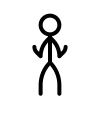          |
| real                     | 244    | A hard concept to express visually. Emojese uses a resultative complement (see “become”), with ◌ Dotted Circle transitioning to ○ White Circle to suggest something becoming more real.                                                                                                                                                                                                                                                                                                                                                                          | ◌○               |
| restaurant               |        | Given the prevalence of food emoji, it’s surprising there is no obvious emoji for a location that serves food. Emojese uses 🥡 Takeout Box, adding 📍 Round Pushpin for “place”: “takeout food place”. This unfortunately focuses too much on ordering food to go.                                                                                                                                                                                                                                                                                               | 🥡📍             | 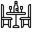     |
| river, stream            |        | As with “lake”, there is no emoji for this common geographical feature. Sadly, it appears that a proposal for <a href="http://www.unicode.org/L2/L2019/19334-river-emoji.pdf">River</a> was rejected. Emojese uses 💧 Droplet for “water”, plus \| Vertical Bar to suggest a flowing river. Compare with "path" and "road".                                                                                                                                                                                                                                      | \|💧\|           | 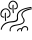          |
| road                     |        | No obvious emoji for this common physical feature and metaphor. 🛣️ Motorway is hard to read, and does not seem appropriate to represent typical roads. Emojese uses 🛞 Wheel between two \| Vertical Bar characters. See also "path" and "river".                                                                                                                                                                                                                                                                                                                 | \|🛞\|            | 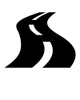           |
| safe (adjective)         |        | No obvious emoji for this admittedly challenging abstract concept. Emojese uses 🦺 Safety Vest, although that has a nuance of mitigating the dangers of a dangerous situation, rather than the intended meaning of being safe from harm. An <a href="https://thenounproject.com/search/?q=safety&i=1490820">icon</a> showing someone or thing being protected might be clearer.                                                                                                                                                                                  | 🦺               |
| seed                     |        | There is 🌱 Seedling but no generic seed. While 🥜 Peanuts and 🌰 Chestnut both represent seeds, neither seems sufficiently generic. (Putting both into a category would likely suggest nuts specifically.) An icon <a href="https://thenounproject.com/search/?q=seed">seed</a> might show a seed being planted. Emojese uses 🪴 Potted Plant and 🥚 Egg: “plant egg”.                                                                                                                                                                                          | 🪴🥚             | 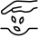        |
| sell                     |        | As with “buy”, there is no obvious emoji for the selling side of a financial transaction. Emojese uses ⬚ Dotted Square, ⇆ Leftwards Arrow Over Rightwards Arrow, and 💵 Dollar Banknote to denote exchanging a thing to acquire money.                                                                                                                                                                                                                                                                                                                           | ⬚⇆💵             |
| shallow                  |        | No obvious emoji. See also “deep”. Emojese uses ⌊ Left Floor for “low”, and 💧 Droplet for “water”: so “low water”.                                                                                                                                                                                                                                                                                                                                                                                                                                              | ⌊💧              |
| side                     | 294    | No obvious emoji to express something on the side, or to the side, of something or some place. Emojese uses ⚆ White Circle with Dot Right.                                                                                                                                                                                                                                                                                                                                                                                                                       | ⚆                |
| sister                   |        | No obvious emoji; see “brother”. Emojese: “related girl”.                                                                                                                                                                                                                                                                                                                                                                                                                                                                                                        | 🔗👧             |
| slow                     |        | As with “big”, Emojese uses an animal that characterizes a noteworthy quality — here, extremely slow movement — and add a tilde (“-ish”) to form an adjective. In this case, Emojese uses 🐌 Snail as an epitome of slowness.                                                                                                                                                                                                                                                                                                                                    | 🐌~              |
| smart                    |        | No obvious emoji. Emojese uses the same 🎓 Graduation Cap as for “know”, adding a tilde (“-ish”) to form an adjective.                                                                                                                                                                                                                                                                                                                                                                                                                                           | 🎓~              |
| spring (season)          |        | See “fall” (season). Emojese uses 🌷 Tulip as an example of a springtime flower: “tulip time”.                                                                                                                                                                                                                                                                                                                                                                                                                                                                   | 🌷⏰             |
| steal                    |        | No obvious emoji. Emojese uses 🦝 Raccoon. A raccoon’s black facial features are often taken for a black mask, resulting in frequent cartoon representations as a thief.                                                                                                                                                                                                                                                                                                                                                                                         | 🦝               |   |
| store, shop (noun)       |        | No obvious emoji for a common one-story retail business. Icons for <a href="https://thenounproject.com/search/?q=store">store</a> frequently a one-story building with an awning. There is 🏬 Department Store, which not only seems too big, it doesn’t obviously seem to be a store. 🏪 Convenience Store focuses on 24-hour business. Emojese settles for the former.                                                                                                                                                                                         | 🏬               | 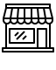          |
| sugar                    |        | No obvious emoji for this ubiquitous substance. Emojese uses ◻️ White Medium Square and 🍯 Honey Pot.                                                                                                                                                                                                                                                                                                                                                                                                                                                            | ◻️🍯             | 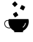          |
| summer                   |        | See “fall” (season). Emojese uses ☀️ Sun: “sun time”.                                                                                                                                                                                                                                                                                                                                                                                                                                                                                                            | ☀️⏰             |
| table                    |        | There is 🪑 Chair, but no table to put the chair at. Echoing the popular table-flipping kaomoji, Emojese adopts two copies of ┳ Box Drawings Heavy Down and Horizontal to visually depict a table.                                                                                                                                                                                                                                                                                                                                                               | ┳┳               | 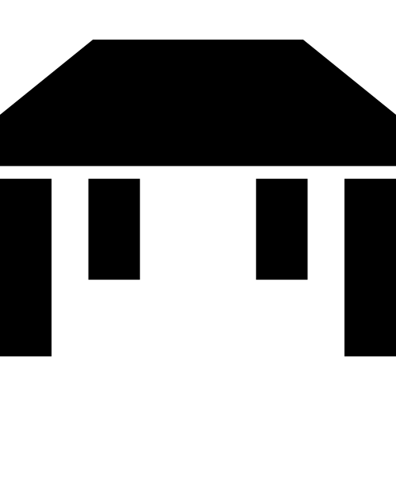          |
| team                     | 234    | No obvious emoji for a multi-person team of people in an organization (as opposed to a family). Icons for <a href="https://thenounproject.com/search/?q=team">team</a> usually show at least three people, often with circles or lines to suggest an organizational chart. The two brackets, ⟨ Mathematical Left Angle Bracket and ⟩ Mathematical Right Angle Bracket, are used in some mathematical contexts for a group, so Emojese adopts those brackets generally to mean “group”. Here Emojese adds 👥 Busts in Silhouette for “people”: “group of people”. | ⟨👥⟩             | 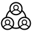           |
| test                     |        | No obvious emoji. Icons for <a href="https://thenounproject.com/search/?q=test">test</a> often show a clipboard with correct and incorrect answers. The existing 📋 Clipboard shows instead lines of text. Emojese uses 📄 Page Facing Up with ☐ Ballot Box and ☑ Ballot Box with Check. Although Sweden and Finland uses a check mark for an incorrect answer rather than a correct answer, the use of a check mark still seems appropriate (if less upbeat).                                                                                                   | 📄☐☑             | 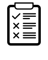            |
| theater                  |        | 🎭 Performing Arts suggests theater as an activity or profession, but not the physical building. Emojese adds 📍 Round Pushpin for “place”: “theater place”.                                                                                                                                                                                                                                                                                                                                                                                                     | 🎭📍             | 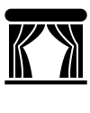         |
| thing                    | 221    | No obvious emoji for the admittedly highly abstract concept of a thing. Emojese uses ⬚ Dotted Square.                                                                                                                                                                                                                                                                                                                                                                                                                                                            | ⬚                |
| throw                    |        | There are emoji like ⚾ Baseball to represent specific things which are thrown, but no emoji for the action. Emojese adds ⇝ Rightwards Squiggle Arrow to convey action.                                                                                                                                                                                                                                                                                                                                                                                          | ⚾⟿              | 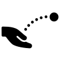          |
| toe                      |        | Another missing body part (see “back” and "finger"). Emojese: “foot part”.                                                                                                                                                                                                                                                                                                                                                                                                                                                                                       | 🦶🧩             |
| top                      |        | No obvious emoji. Emojese uses ⌈ Left Ceiling and ꠵ North Indic Fraction Three Sixteenths to visually indicate the top of a stack.                                                                                                                                                                                                                                                                                                                                                                                                                               | ⌈꠵               |           |
| town                     |        | No obvious emoji for a municipality smaller than a city with skyscrapers. Emojese uses 🤏 Pinching Hand for “small”, so: “small city”.                                                                                                                                                                                                                                                                                                                                                                                                                           | 🤏🏙️             | 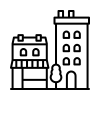           |
| under                    |        | See notes for “above”. Here ◒ Circle with Lower Half Black represents being beneath something else.                                                                                                                                                                                                                                                                                                                                                                                                                                                              | ◒                |           |
| ugly                     |        | As with “pretty”, there is no obvious emoji to represent physical or metaphorical unattractiveness. Emojese uses 🪞 Mirror with 🤢 Nauseated Face to represents a reaction to ugliness.                                                                                                                                                                                                                                                                                                                                                                          | 🪞🤢             |
| valley                   |        | There is ⛰️ Mountain, but no valley. Emojese adds ⧲ Error-Barred White Circle for "between": “between mountains”.                                                                                                                                                                                                                                                                                                                                                                                                                                                | ⧲🏔               |
| wall                     |        | There is 🧱Brick and 🪵 Wood, but no wall to make with them. Emojese uses the former, adding ‖ Double Vertical Line to suggest a wall.                                                                                                                                                                                                                                                                                                                                                                                                                           | 🧱‖              |            |
| we/us                    | 26/93  | Like I/me, these are extremely frequent words. Two or more people with arms over shoulders begins to capture the concept. As with “I”, it might help to have one or more of the people pointing to themselves. It’s hard to use existing emoji like 🧑‍🤝‍🧑 People Holding Hands that have a specific appearance (skin tone, outfit) if the “we” being expressed don’t look like that. Emojese settles for reduplication of the same 👇 Backhand Index Pointing Down to uses for “I” to form “I plural”, i.e., “we”.                                                  | 👇👇             | 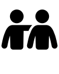     |
| wear                     |        | There are various emoji for articles of clothing, but nothing for the action of getting dressed. Emojese uses 👖 Jeans with ⇝ Rightwards Squiggle Arrow to convey action.                                                                                                                                                                                                                                                                                                                                                                                        | 👖⟿              |
| week                     | 263    | As with “month” and “year”, there is no emoji for this division of time. Icons for <a href="https://thenounproject.com/search/?ek">week</a> often highlight a single row in a month calendar. Emojese uses ☀️ Sun for “day”, adding ⓻ Double Circled Digit Seven: “seven days”.                                                                                                                                                                                                                                                                                  | ⓻☀️              |             |
| wide, thick              |        | No obvious emoji. As with “narrow”, Emojese uses lines and arrows to suggest width. Here: ⟷ Long Left Right Arrow between two instances of \| Light Vertical Bar.                                                                                                                                                                                                                                                                                                                                                                                                | \|⟷\|            |
| winter                   |        | See “fall” (season). Emojese uses ❄️ Snowflake: “snow time”.                                                                                                                                                                                                                                                                                                                                                                                                                                                                                                     | ❄️⏰             |
| year                     | 121    | As with “week” and “month”, there is no emoji for this division of time. One icon for <a href="https://thenounproject.com/search/?ar">year</a> shows a complete <a href="https://thenounproject.com/search/?q=year&i=2612190">orbit around the sun</a>. Emojese accomplishes the latter via ⥁ Clockwise Closed Circle Arrow around the ☀️ Sun.                                                                                                                                                                                                                   | ⥁☀️              |            |

If you’d like to suggest an improvement to an Emojese solution, please [propose or request a definition](https://docs.google.com/forms/d/1-TFomAkbYQyJSD6b-8vi-jDbahqxcg53DqtLmdo940A/).

If you’re interested in working on improving emoji as a visual language, send a message to [@JanMiksovsky](https://fosstodon.org/@JanMiksovsky).
